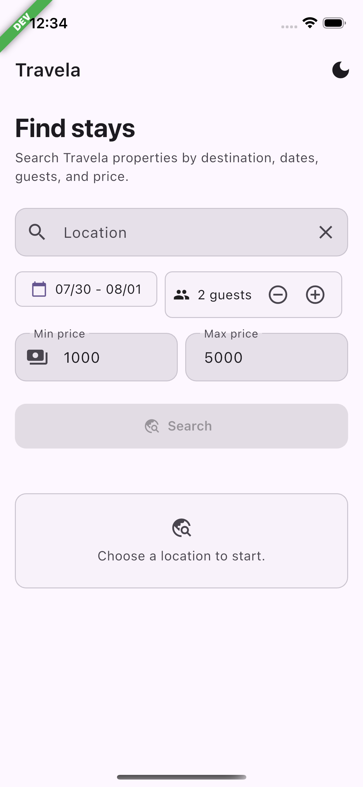
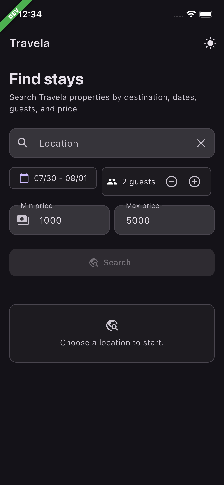
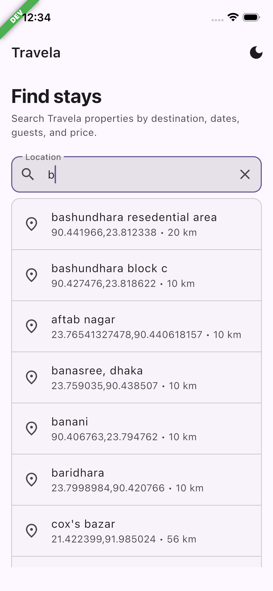
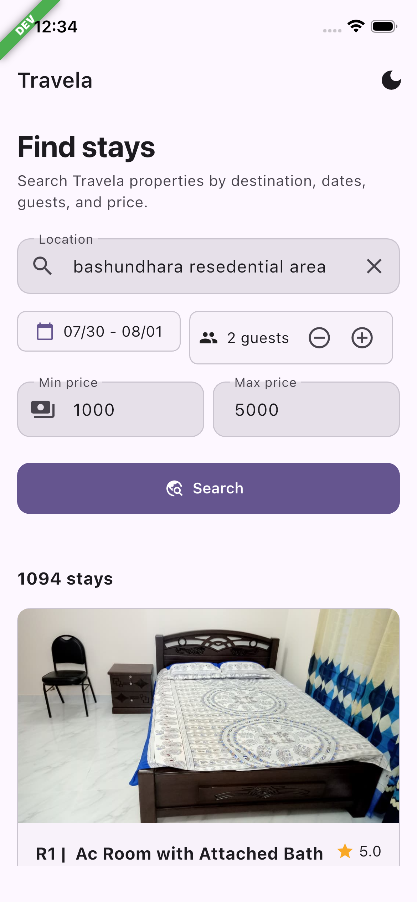
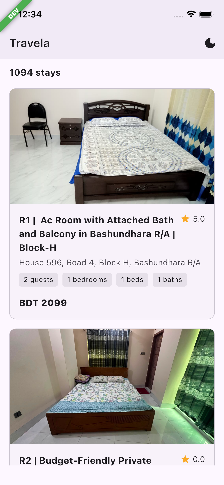
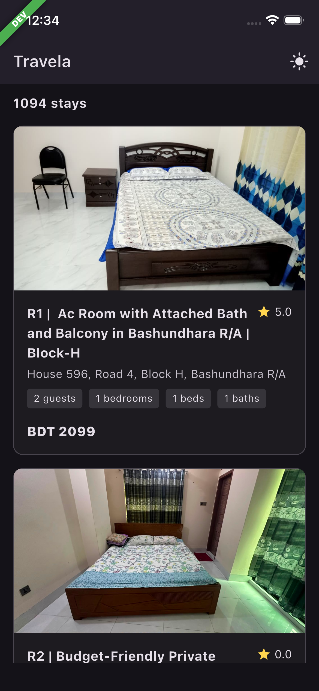

# Travela - Property Search (Home Task)

A single-screen Flutter application implementing real-time travel property search over Server-Sent Events (SSE), location autocomplete, and filter controls.

##  Architecture & Design Decisions

The codebase follows Clean Architecture with a **feature-first** structure:

```text
lib/
├── app/
│   └── app_di/
│       └── app_di.dart       # Master Dependency Injection setup
├── core/
│   └── di/
│       └── core_di.dart      # Core-level registrations (Network, Storage)
└── features/
    ├── di/
    │   └── property_search_di.dart # Feature-specific DI wiring
    └── property_search/
        ├── data/             # Datasources, DTO models & repository implementations
        ├── domain/           # Entities, repository contracts & use cases
        └── presentation/     # BLoc, pages & UI components

```

* **State & Data Flow:** Uses `flutter_bloc` for state management and `dartz` (`Either<Failure, T>`) for  error handling across domain boundaries.
* **Network Layer:** Powered by `dio`. Requests use `CancelToken` to abort stale autocomplete queries and active SSE streams whenever user input changes or the widget disposes.
* **Sentinel CopyWith Pattern:** To handle setting nullable state properties back to `null` cleanly, a private sentinel object pattern is used across BLoC states.


### Location Search Debounce & Request Lifecycle

The `LocationSearchBloc` manages location query changes with a 450ms timer debounce to avoid unnecessary network overhead:

* **Debounce Delay:** Timer waits 450ms after the last keypress before dispatching `LocationSearchRequested`.
* **Cancellation:** Typing a new query, selecting a location, or clearing input immediately cancels the active `Timer` and aborts the in-flight HTTP request via Dio's `CancelToken`.
* **Cleanup:** When the BLoC closes, all timers and active requests are cleaned up to prevent memory leaks and race conditions.

### SSE Stream Lifecycle (`PropertySearchBloc`)

* **Incremental State Updates:** Processes domain stream events (`meta`, `item`, `done`, `error`) and appends property cards (`[...state.properties, property]`) without blocking the UI thread.
* **Deterministic Cleanup:** Always calls `_cancelActiveStream()` (cancelling both `CancelToken` and `StreamSubscription`) on new searches, cancellations, or BLoC disposal to prevent memory leaks and race conditions.
* **Internal Event Bridge:** Encapsulates stream emissions into private internal events (`_PropertySearchStreamEventReceived`, `_PropertySearchFailed`) to maintain state mutation safety.
* **Retry Support:** Caches execution parameters (`lastParams`) to handle network failures gracefully with `PropertySearchRetryRequested`.


## SSE Stream Parsing

The search endpoint returns a `text/event-stream`. Instead of waiting for the full HTTP payload to complete, the app processes the incoming byte stream frame-by-frame:

```dart
body.stream
  .cast<List<int>>()
  .transform(utf8.decoder)
  .transform(const LineSplitter());

```

Incoming frames are converted into domain events (`meta`, `item`, `done`, `error`), rendering properties on-screen instantly as `item` events land.

## Flavors

The project supports two flavor entry points:

* **Dev:** `lib/main_development.dart` (Default via `lib/main.dart`)
* **Prod:** `lib/main_production.dart`

### Commands

```bash
# Run Development
flutter run -t lib/main_development.dart

# Run Production
flutter run -t lib/main_production.dart
```

---

<p align="center">
  
  &nbsp;&nbsp;
  
  &nbsp;&nbsp;
  
    &nbsp;&nbsp;
  
  &nbsp;&nbsp;
  
  &nbsp;&nbsp;
  
  
</p>

--- 

### Travela-Task-Video

<p align="center">
  <a href="https://youtube.com/shorts/jADvpfVwbUE?si=bVEql8dUbq52o7Cv">
    
  </a>
  <br />
  <sub> Click here to watch TravelaTask on YouTube Shorts</sub>
</p>


